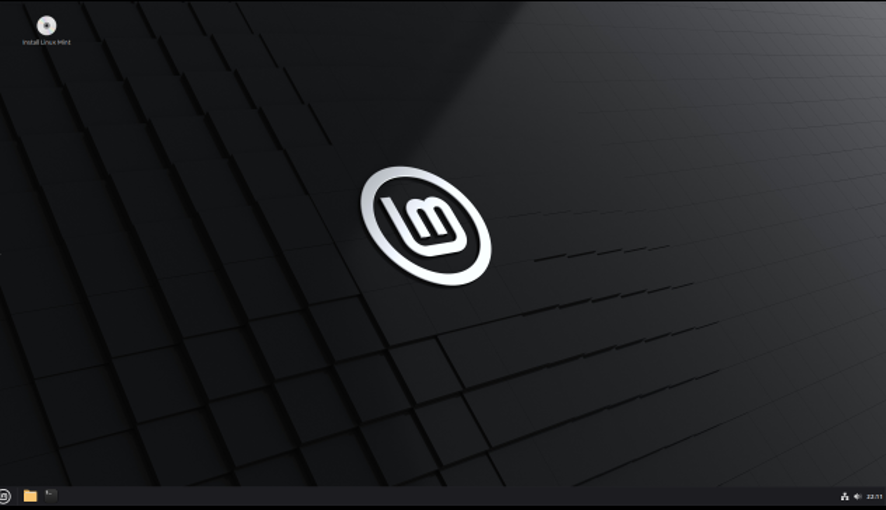
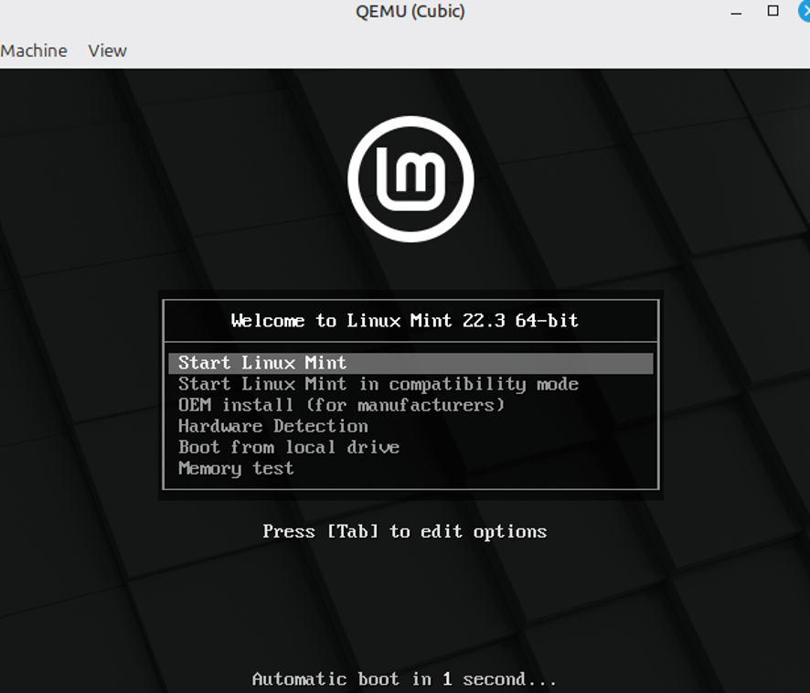
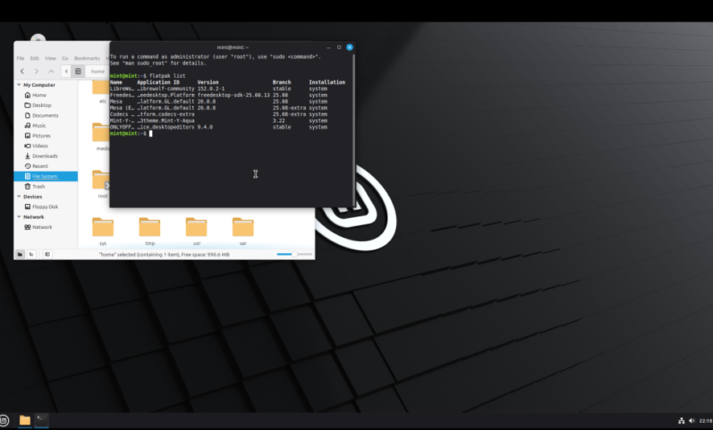
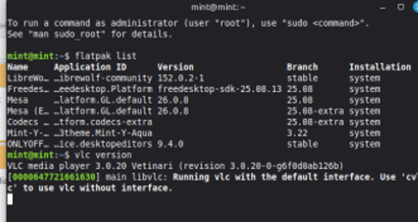

# Part 1 — Custom Linux Distro with Cubic

## Group members
- Nicolás Villacres (Part 1)
- Dayanna (Part 2)
- Luis Tenemaza (part 3)

## Base ISO
Linux Mint 22.3 "Zena" — Cinnamon Edition (64-bit)

## Tool
Cubic (Custom Ubuntu ISO Creator)

## Environment
- Host: Windows + Oracle VirtualBox
- VM: TitoLover — 4096 MB RAM, 2 CPUs, 40 GB disk
- Guest: Linux Mint 22.3 Cinnamon (64-bit)
- Cubic installed via PPA: ppa:cubic-wizard/release

## Modifications

### 1. Firefox → LibreWolf
- Removed Firefox (`apt remove firefox`)
- Installed Flatpak + LibreWolf via Flathub
- **Justification:** LibreWolf is a privacy-focused Firefox fork, free and open-source, with telemetry removed. Flatpak ensures sandboxed, reproducible installation.

### 2. OnlyOffice Desktop Editors
- Installed via Flathub (`org.onlyoffice.desktopeditors`)
- **Justification:** Free, open-source office suite with better Microsoft Office format compatibility than LibreOffice.

### 3. VLC Media Player (default)
- Installed via `apt install vlc`
- Set as default for video/mp4 with `xdg-mime default vlc.desktop video/mp4`
- **Justification:** VLC supports far more codecs out of the box. Setting it as default ensures persistence for all new user sessions.

## ISO Generation
- Project folder: `/home/nico/linux`
- Filename: `linuxmint-2026.06.24.iso`
- Size: 4.39 GiB (4,709,896,192 bytes)
- Compression: XZ
- Disk Name: Linux Mint 22.3.0 2026.06.24 "Custom Zena"

## Checksum (MD5)
| File | MD5 Checksum |
|------|-------------|
| linuxmint-2026.06.24.iso | 5e7fd4ba9ad673f5a042b6dd818a4bbb |

## Boot Test
- Sistema bootea correctamente en QEMU (compatibility mode)
- LibreWolf 152.0.2.1 confirmado via `flatpak list`
- OnlyOffice 9.4.0 confirmado via `flatpak list`
- VLC 3.0.20 confirmado via `vlc version`

## Demo Video
