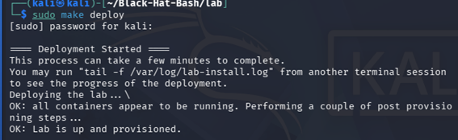
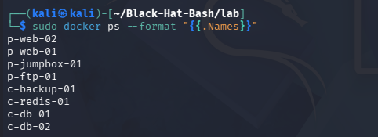
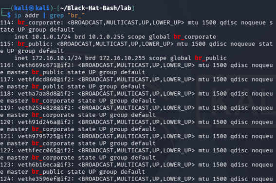
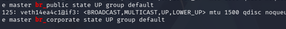
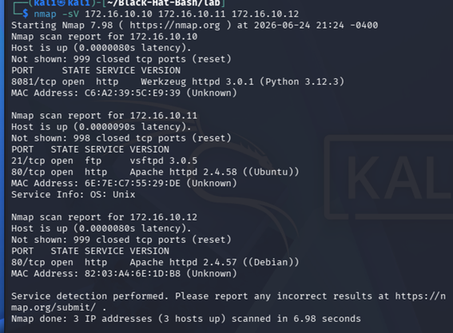
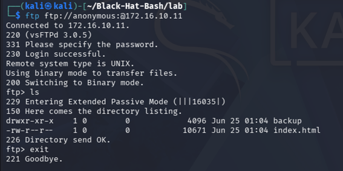

# Part 3 — Black Hat Bash Lab: Setup & Attack

**Reference:** Chapter 3, *Black Hat Bash* (Dolev Farhi & Nick Aleks)
**Book repo:** https://github.com/dolevf/Black-Hat-Bash
## Environment
- Host: Windows + Oracle VirtualBox
- VM: kali-linux-2026.1-virtualbox-amd64 — 4096 MB RAM, 2 CPUs, 80 GB disk
- Guest: Kali Linux 2026.1 (Debian 64-bit)
- Docker + Docker Compose installed from the official Docker repository

## 3.A — Lab Setup
### Deploy

```bash
cd ~/Black-Hat-Bash/lab
sudo make deploy
```

Output:
==== Deployment Started ====
This process can take a few minutes to complete.
You may run "tail -f /var/log/lab-install.log" from another terminal session
to see the progress of the deployment.
Deploying the lab ... \
OK: all containers appear to be running. Performing a couple of post provisioning steps ...
OK: Lab is up and provisioned.
```make deploy


### Verification

```bash
sudo make test
```
Output: `Lab is up.`
    make test 


```bash
sudo docker ps --format "{{.Names}}"
```
Output:
```
p-web-02
p-web-01
c-jumpbox-01
p-ftp-01
c-backup-01
c-redis-01
c-db-01
c-db-02
```
sudo docker


```bash
ip addr | grep "br_"
```
Output:
```
br_corporate: inet 10.1.0.1/24 brd 10.1.0.255 scope global br_corporate
br_public:    inet 172.16.10.1/24 brd 172.16.10.255 scope global br_public
```
ip addr 



### Access Demo

```bash
sudo docker exec -it p-web-01 bash
```
Output: `root@p-web-01:/app#`
docker


### Lab Architecture

| Machine | Public IP | Corporate IP | Hostname |
|---|---|---|---|
| Kali host | 172.16.10.1 | 10.1.0.1 | — |
| p-web-01 | 172.16.10.10 | — | p-web-01.acme-infinity-servers.com |
| p-ftp-01 | 172.16.10.11 | — | p-ftp-01.acme-infinity-servers.com |
| p-web-02 | 172.16.10.12 | 10.1.0.11 | p-web-02.acme-infinity-servers.com |
| c-jumpbox-01 | 172.16.10.13 | 10.1.0.12 | c-jumpbox-01.acme-infinity-servers.com |
| c-backup-01 | — | 10.1.0.13 | c-backup-01.acme-infinity-servers.com |
| c-redis-01 | — | 10.1.0.14 | c-redis-01.acme-infinity-servers.com |
| c-db-01 | — | 10.1.0.15 | c-db-01.acme-infinity-servers.com |
| c-db-02 | — | 10.1.0.16 | c-db-02.acme-infinity-servers.com |

Two networks: **public** (`br_public` 172.16.10.0/24) for exposed services, and **corporate** (`br_corporate` 10.1.0.0/24) for internal machines only.

---

## 3.B — Hacking Techniques (Bonus)

> ⚠️ All techniques run exclusively against the lab's isolated containers.

### 1. Port Scanning with Nmap — Basic

```bash
nmap -sV 172.16.10.10 172.16.10.11 172.16.10.12
```

- **What it does:** Sends probes to common TCP ports and uses `-sV` to detect the software version behind each open port.

Output:
```
PORT     STATE SERVICE VERSION
8081/tcp open  http    Werkzeug httpd 3.0.1 (Python 3.12.3)   [172.16.10.10]

PORT   STATE SERVICE VERSION
21/tcp open  ftp     vsftpd 3.0.5                             [172.16.10.11]
80/tcp open  http    Apache httpd 2.4.58 ((Ubuntu))           [172.16.10.11]

PORT   STATE SERVICE VERSION
80/tcp open  http    Apache httpd 2.4.57 ((Debian))           [172.16.10.12]

Nmap done: 3 IP addresses (3 hosts up) scanned in 6.98 seconds



- **Interpretation:** `p-web-01` runs a Werkzeug dev server (not production-ready, may expose a debug interface). `p-ftp-01` has FTP open on port 21, which motivates testing for anonymous login. `p-web-02` runs Apache and could be probed further.

### 2. Anonymous FTP Login — Intermediate

```bash
ftp ftp://anonymous:@172.16.10.11
ftp> ls
```

- **What it does:** Tries to log in with the `anonymous` account and no password — a common misconfiguration that exposes files without credentials.

Output:
```
230 Login successful.
drwxr-xr-x    1 0        0            4096 Jun 25 01:04 backup
-rw-r--r--    1 0        0           10671 Jun 25 01:04 index.html
226 Directory send OK.
```


- **Interpretation:** vsftpd 3.0.5 allows anonymous access with no credentials. The exposed `backup/` directory could contain config files, database dumps, or credentials in a real environment.
- **Remediation:** Set `anonymous_enable=NO` in `/etc/vsftpd.conf` and restart the service.

---

## How to Reproduce

```bash
git clone https://github.com/dolevf/Black-Hat-Bash.git
cd Black-Hat-Bash/lab
sudo make deploy
sudo make test
sudo docker ps --format "{{.Names}}"
ip addr | grep "br_"
nmap -sV 172.16.10.10 172.16.10.11 172.16.10.12
ftp ftp://anonymous:@172.16.10.11
```
